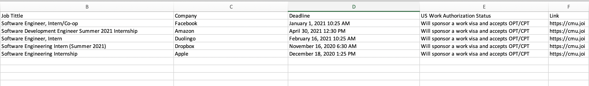

# CMU-Handshake-Job-Scrapper

### Installation

> pip install -r requirements.txt

> Add chromedriver path and cmu id pass in Handshake.py

> Add handshake links to links.txt

> python3 handshake.py

#### Sample Output

